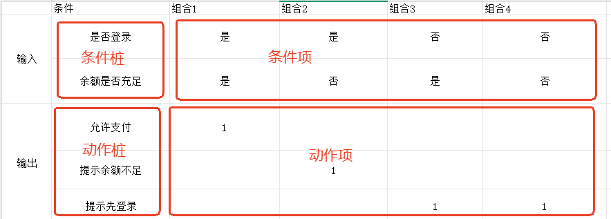
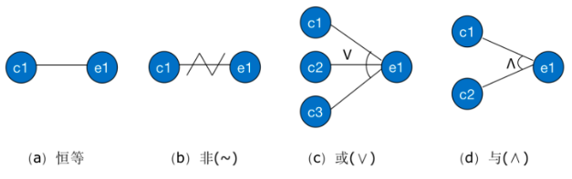
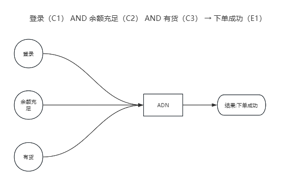
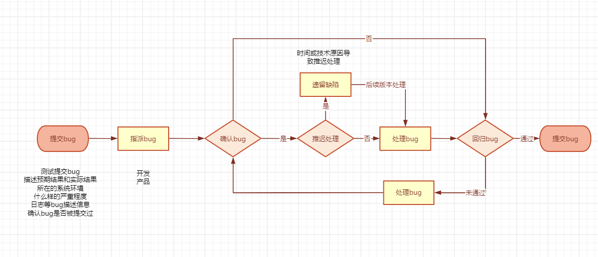

# APP测试流程

说实话我的文笔有点差，构思了很久没想出像其他博主那样将文章写的那么引人入胜，不过还好写的是技术文章，只要能够把自己的观点说清楚也算是一篇能看的下去的文章。

不过在开始讲具体内容之前还是要唠叨一下，在移动互联网的历史里，2007 年乔帮主发布第一代 iPhone，从那以后，App 伴随 3G → 4G → 5G 的演进，已经走过了将近 20 年的发展历程。应用的形态层出不穷，从最初的通讯、工具，到如今的支付、出行、娱乐、AI 助手，几乎覆盖了我们生活的方方面面。

随着功能越来越复杂、用户体验要求越来越高，App 测试也从最初的“点点点”逐步成长为一套完整的质量保障体系。
今天的测试不仅要考虑功能是否正确，还要关注性能、兼容性、安全性，以及在复杂网络环境和海量机型下的稳定性。

对于Web3领域来说大多都是10人左右的创业团队，很少会有专门的测试工程师保证软件的质量，所以想通过几篇文章简单梳理一下App质量保证流程，算是对自己知识做个总结，也说一下为什么测试总是给你提bug（开发老师口头禅：时间都用来给你解bug了）。（App测试流程、测试用例设计、自动化测试框架、STF多机并行测试、Gitlab CI/CD/Jenkins CI/CD、专项测试（冷启动、热启动、性能、耗电、兼容））

## 测试流程

对于开发来说拿到一个从测试角度来说拿到一个app（或某个功能模块）的需求后要进行开发测试流程分为下面11个步骤：

* 需求分析：

    分析开发和产品提供的文档，比如产品原型图、产品PRD、开发的技术方案、架构图等，对于测试来说这一步至关重要，对功能的理解程度决定了测试用例的质量，也决定了该功能最终的测试质量。

* 测试计划编写：

    当梳理完测试需求后，测试会根据该需求制定一份测试计划明确为什么进行这些测试，谁测试，怎么测，用什么测，什么时候测，测到什么程度等，大多数分为下面几个点（但实际在工作中测试计划一般都简单写一下或者leader写组员负责补充，主要还是以测试用例为主作为评审的核心）：

    * 测试目标：明确这次测试的目的是什么（比如功能验证、性能瓶颈发现、兼容性验证等）。
    * 测试范围：列出需要测试的功能模块、接口、业务流程，明确不测或暂不测的部分，避免后续出现遗漏或范围不清。
    * 测试策略与方法：说明将采用哪些测试方法：黑盒、白盒、自动化测试、性能测试等。
    * 测试资源和环境：确定所需的硬件环境（服务器、客户端设备）、软件环境（数据库、操作系统、浏览器版本、App版本）。
    * 测试进度：制定测试开始、测试完成、回归、验收、上线前测试等关键节点。
    * 人员分工：谁做用例设计、谁做性能测试、谁负责回归执行。

* 测试用例设计：
    
    关于测试用例设计对于没有了解过测试的同学来说，可能会觉的测试用例是根据产品的需求想出来的，其实这个说法并不完全是完全对的，因为单靠测试一点点靠着经验想测试点是一定无法覆盖全面的，进而导致产品的质量难以把控，好在测试领域的前辈总结出了一套测试用例的设计方法论在一定程度上提高了对于产品的覆盖度，所以现在的测试用例设计一般都是根据 **文档+测试方法+个人业务经验** 的方式设计出来的。

    下面简单列一下常用的几种用例设计方法（我就不说哪些官方术语了，感觉大白话更容易理解些）：

    1. 等价法：分为有效等价和无效等价
        * 示例1：比如接口的参数类型是bool类型，那么一个就是有效、一个就是无效；
        * 示例2：比如前端界面的输入框，产品限定了只可以输入数字，那么有效等价就是输入合法数字，无效等价就是输入包含字母的不合法输入；
    2. 边界值分析法：1~10边界值就是（0，1，10，11）
        * 示例1：需求 输出 >=0 <=99 的整数 比如 for(int i = 0; i < 99;i++) 只输出0~98；（选取正好等于、刚好大于或刚好小于边界值作为测试数据（0、99、100、-1））
    3. 判定表：把不同条件的组合，以及这些组合对应的行为，整理成一个表格防止漏下

        * 条件桩：需要考虑的条件
        * 条件项：条件桩的取值（是/否，或者不同值）
        * 动作桩：可能发生的系统行为（输出、结果）
        * 动作项：在具体条件组合下实际会发生的行为

        * 示例1：支付功能（需求：1. 用户必须登录才能支付；2. 支付时余额要足够，否则提示“余额不足”；3. 未登录就提示“请先登录”）
    
        
        
    4. 因果图法：将条件和结果之间的关系化成图，帮助覆盖测试用例，类似工作中我们使用的思维导图（因 —— 输入条件；果 —— 输出结果）
        * 恒等：若原因出现，则结果出现；若原因不出现，则结果也不出现

        * 非：若原因出现，则结果不出现；若原因不出现，则结果出现

        * 或：有多个原因。若几个原因中有一个出现，则结果出现；若几个原因都不出现，则结果不出现

        * 与：有多个原因。若几个原因都出现，则结果才出现；若其中一个原因不出现，则结果不出现

        
        * 示例：（需求：用户下单是否成功取决于三个条件：1. 是否已登录；2：余额是否充足；3.库存是否有货）
        
        

    5. 场景法：场景法就比较直观了，就是模拟用户使用情况（实际工作中就是根据开发或者产品文档中写的业务流程图，分成正确的流程和错误的流程，确保用例对业务的覆盖率）
    
        * 比如：DeFi 应用中的「质押代币（Staking）」功能
    
            * 正确流程（主干场景）：打开 DeFi App->并连接钱包->进入「质押」页面，选择要质押的代币->输入质押数量->确认交易 → 钱包弹出确认框 → 用户签名并支付 Gas 费用->区块链网络确认交易，App 页面提示“质押成功”
        
            * 错误流程（异常场景）：未连接钱包 → 点击“质押”提示连接钱包; 余额不足 → 提示不足; 用户拒绝 → 取消交易; 链上执行失败 → 交易失败等

* 测试用例评审: 测试同学拉会，将开发、产品等相关同学拉齐。来检查用例是否完整、准确，帮助团队在测试前统一对需求的理解，提前发现潜在问题

    * 对测试同学的要求：讲解用例的思路、覆盖点和预期结果，并对于需求中存在不确定或模糊的地方，要在评审过程中提出，确保大家对需求理解一致。记录评审过程中的修改意见，并在会后对用例进行更新和完善。
    
    * 对开发同学的要求：评审中检查测试用例是否覆盖了所有关键场景和边界条件；对于遗漏的场景要及时补充说明，并提出补充测试点的建议；如果发现用例设计不合理，要提出质疑并与测试同学确认；针对测试提出的疑问，给出解释或在必要时反馈给产品或架构确认。

    * 评审的价值：提高测试质量，防止理解偏差，预防后期扯皮提高整体效率；

* 用例执行：执行评审后的测试用例，提交缺陷；
    * 如何判定提交的bug是不是bug（当开发认为测试提价的bug不是bug的时候，测试同学一般会通过下面思路进行判定）：
        * bug描述不够清晰：提高自己的水平。
            * 完善bug复现步骤，将日志、录屏、问题截图等，完善到bug描述中
        * 偶现bug：留好证据，截图、录屏、日志等信息，为后面发现做准备。
            * 当bug按照步骤难以复现时，保留bug截图、录屏、日志等信息，保留证据
        * 争议bug（建议类）：开会讨论。
            * 和产品、开发一起讨论，根据自己的依据表达清楚自己的建议，最终改不改取决于产品或者领导
        * 功能性bug（需求理解不一致的bug）：提供证据，需求文档，产品原型等，可以省去很多争议。
            * 功能确实存在bug，但是从开发的角度觉得没有问题，或者开发对需求分析不够全面，对于这种要摆出证据，拿出需求给到开发

* 回归测试：对开发提交了PR并回归给测试这边的缺陷进行再次验证，没问题则状态改为通过，还是有问题则重新描述清楚打回开发；

* 非功能测试

* 走查验收（UI、产品）：产品对功能进行验收，有问题测试同学补充缺陷，开发解决后在进行回归；

* 测试总结报告：常规的测试报告主要是下面几个模块，但是每个公司的标准不一样，需要和开发、产品等共同制定一份符合公司内部的报告

* 灰度发布: 就是内测，用于规避上线的风险，缩小影响范围（让一部分用户继续用产品旧版本特性A，一部分用户开始用新版本特性B，如果用户对B没有什么反对意见，那么逐步扩大范围，把所有用户都迁移到B上面来）

* 上线：
    * Google Play Store 上线流程：
        1. 准备开发者账号设置 Google Merchant Account (如果需要)
        2. 在 Google Play Console 中创建应用和商店列表
        3. 配置应用内容和分级
        4. 上传和准备发布版本
        5. 设置价格和分发
        6. 提交审核
        7. 发布上线
        8. 后续维护和更新

        [https://learn.microsoft.com/zh-tw/appcenter/distribution/stores/googleplay](https://learn.microsoft.com/zh-tw/appcenter/distribution/stores/googleplay)

    * App Store上线流程：

        [https://learn.microsoft.com/zh-tw/appcenter/distribution/stores/apple](https://learn.microsoft.com/zh-tw/appcenter/distribution/stores/apple)

    

## 常见缺陷
* 功能缺陷：

* 

## bug处理流程

## 基于模型测试
